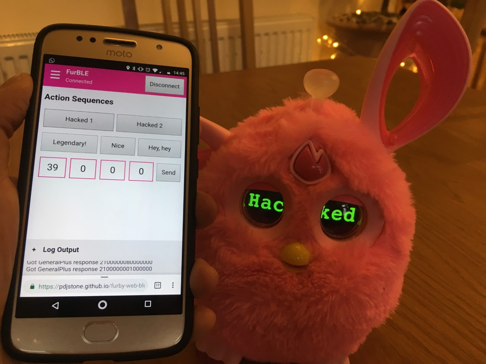

# FurBLE - Furby Web Bluetooth Demo
Use Web Bluetooth to control your Furby Connect! Works best for Chrome on Android. No support for ios/ipadOS, sorry. :(

## To test this out, [click here](https://raffabenoja.github.io/furble/furble.html)
## You can also input pre-programmed [list of actions here](https://github.com/Jeija/bluefluff/blob/master/doc/actionlist.md)

# IMPORTANT!
Reset the Furby Connect every time you want to upload a new DLC. This is to avoid bricking.

## To reset the Furby Connect:
- Make sure the Furby is awake, and turn it upside down
- Push its tongue and pull its tail for 10 seconds.
- The furby's eyes will turn off. If it doesn't repeat step 1. When it does turn off, you can wake it up again.

### Working:
- Connect to / disconnect from Furby
- Send basic commands (e.g. actions, set antenna colour)
- Send custom action numbers (see [list of action sequences](https://github.com/Jeija/bluefluff/blob/master/doc/actions.md))
- Upload and activate DLC files
- Decode and display Furby state (antenna joystick, body sensors, orientation)
